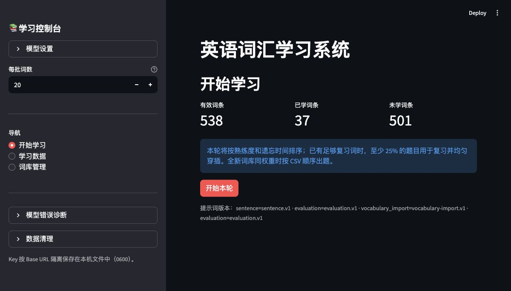
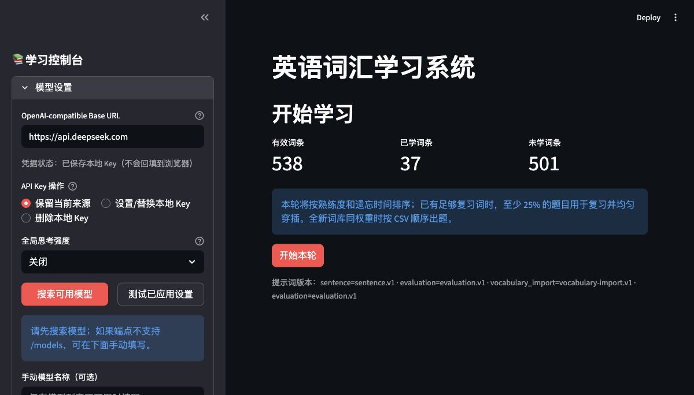
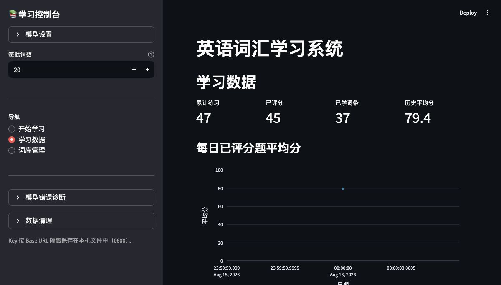
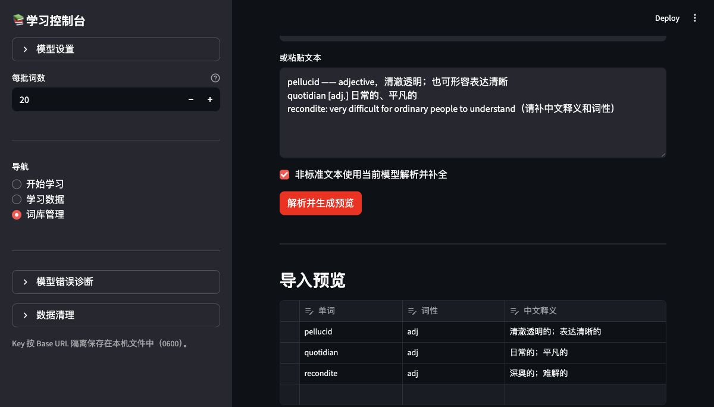

# LLM TransVocab

一个面向“熟词僻义”和长期复习、以翻译练习为核心的本地 Streamlit 词汇学习应用。它调用任意 OpenAI-compatible 模型生成指定义项的英文例句、评估英译中答案，再结合熟练度与艾宾浩斯式时间衰减安排复习。



## 功能概览

- 只配置一个 OpenAI-compatible 端点，不绑定特定供应商
- 从端点 `/models` 实时搜索模型；不支持模型列表时也可手填
- GUI 切换 Base URL、API Key、模型与全局思考强度
- 默认 20 词短批次，复习词按时间权重均匀穿插
- 同一拼写的不同词性、不同义项分别学习和记忆
- 当前题作答时，单线程后台预生成下一题
- AI 评分允许合理意译，并提供中文改进建议
- CSV/TXT/粘贴文本批量导入，支持 AI 整理与可编辑预览
- SQLite 持久化熟练度和逐题历史
- 脱敏错误日志记录结束原因、token 用量、耗时和请求 ID

## 快速开始

推荐 Python 3.11。本项目开发和测试使用 conda 环境：

```bash
conda create -n english python=3.11 -y
conda activate english
python -m pip install -r requirements.txt
streamlit run vocab_web.py
```

默认地址是 `http://localhost:8501`。首次打开后，先在左侧展开“模型设置”。

## 配置模型

应用使用 OpenAI Chat Completions 兼容接口。最少需要三个信息：

| 配置项 | 含义 | DeepSeek 示例 |
| --- | --- | --- |
| Base URL | OpenAI-compatible API 根地址 | `https://api.deepseek.com` |
| API Key | 该端点签发的访问密钥 | 在 DeepSeek 平台创建 |
| Model | `/models` 返回的模型 ID | `deepseek-v4-flash` |



### DeepSeek 配置示例

1. 在 [DeepSeek API Keys](https://platform.deepseek.com/api_keys) 创建 Key，并确保账户有可用额度。
2. 展开左侧“模型设置”，把 **OpenAI-compatible Base URL** 填为 `https://api.deepseek.com`。这是 DeepSeek 官方文档给出的 OpenAI 格式地址。
3. 在“API Key 操作”选择“设置/替换本地 Key”，粘贴刚创建的 Key。Key 输入框不会在以后重新打开页面时回填。
4. 短例句和评分任务建议把“全局思考强度”设为“关闭”，延迟更低，也能减少 reasoning 占满输出预算后正文为空的概率。
5. 点击“搜索可用模型”。应用会请求端点的 `/models`，然后显示可搜索的模型选择框。
6. 选择 `deepseek-v4-flash`；更重视效果且能接受较高延迟和费用时，可选择 `deepseek-v4-pro`。可用模型应以接口实时返回为准，参见 [DeepSeek 模型列表接口](https://api-docs.deepseek.com/api/list-models) 与 [模型及价格](https://api-docs.deepseek.com/quick_start/pricing)。
7. 点击“应用设置”，再点击“测试已应用设置”。看到连接成功后即可开始学习。

> 不要再使用已退役的 `deepseek-chat` 或 `deepseek-reasoner`。DeepSeek 更新日志说明这两个旧名称已于 2026-07-24 停用；当前 V4 模型 ID 为 `deepseek-v4-flash` 和 `deepseek-v4-pro`。[查看官方更新日志](https://api-docs.deepseek.com/updates/)

### 配置其他 OpenAI-compatible 服务

对 OpenAI、兼容网关或本地模型服务，操作步骤相同：

1. 填写服务提供的 Base URL，例如常见地址会以 `/v1` 结尾。
2. 设置该端点需要的 Key；不需要鉴权的本地端点可以留空。
3. 点击“搜索可用模型”并选择返回的模型。
4. 如果端点没有实现 `GET /models`，在“手动模型名称”中填写服务端要求的精确 ID。
5. “自动”会省略 `reasoning_effort`；其他档位会按 OpenAI-compatible 字段发送。如果模型不支持该字段，改为“自动”或“关闭”后重新测试。
6. 应用设置并执行连接测试。

完整功能至少需要端点兼容：

- `POST /chat/completions`
- `response_format={"type":"json_object"}`，或能够稳定返回 JSON 对象
- 可选的 `GET /models`
- 可选的 `reasoning_effort`

也可以用环境变量提供启动默认值。只有本地没有已保存 Key 时，环境变量才会作为后备：

```bash
export VOCAB_BASE_URL="https://api.example.com/v1"
export VOCAB_API_KEY="your-key"
export VOCAB_MODEL="your-model-id"
export VOCAB_REASONING_EFFORT="disabled"
```

## 学习与复习机制

每次有效评分都会更新熟练度和稳定期。当前复习优先级为：

```text
retention = exp(-elapsed_days / stability_days)
priority  = 1 - mastery × retention
```

优先级越高，越早进入后续批次。默认每批 20 词；已有足够复习词时，至少 25% 的名额来自已学词，并均匀分布在批次中。主动跳过按 0 分更新进度；模型调用失败不写成绩。



### 熟词僻义不是重复错误

词条身份是规范化后的 `word + pos + meaning` SHA-256。同一拼写的不同词性或义项拥有各自的例句、熟练度和复习记录，因此它们可能出现在同一批次中。例如 `strain` 的“压力”和“菌株”会被当作两张不同卡片。只有三项完全相同的记录才会去重。

CSV 新增词会自动成为未学习词；删除词的旧进度会静默成为 orphan；修改词性或释义会生成新的词条 ID。当前批次使用开始时的词库快照，外部修改从下一批生效。

## 词库导入

默认词库是 UTF-8 CSV：

```csv
word,pos,meaning
abandon,v,放弃
abstract,adj,抽象的
```

“词库管理”页面支持：

- 手动添加完整词条
- 用当前模型补齐缺失的词性或释义
- 上传 UTF-8、UTF-8-SIG 或 GB18030 的 CSV/TXT
- 粘贴标准三列表格并在本地解析
- 将散乱文本按每批 50 行交给模型整理
- 在 `data_editor` 中修改预览后一次确认、原子写入
- 跳过完全相同的三字段记录，同时保留同词异义项



标准 CSV/TXT 优先在本地解析，不消耗模型额度；勾选“非标准文本使用当前模型解析并补全”后，无法可靠识别为规范三列的数据会交给模型。模型返回的内容只进入预览，用户确认前不会修改词库。

## 结构化输出与重试

造句、评分和词库整理都使用版本化提示词、JSON 模式和本地字段校验。为了兼容强制 reasoning 的模型：

- 造句和评分从 2000 output tokens 开始，重请求时依次使用 3000、4000、5000
- 批量导入从 20000 开始，重请求时依次使用 22000、24000、26000
- 空正文、`finish_reason=length`、无效 JSON 或字段校验失败时最多重试 3 次
- 非空但不合格的 JSON 会进入单独的修复提示；仍失败时向界面返回可重试错误

DeepSeek 官方也提示 JSON Output 偶尔可能返回空正文，并建议在提示词中提供 JSON 示例、设置合理的 `max_tokens`；本项目已经实现这些保护。[DeepSeek JSON Output 文档](https://api-docs.deepseek.com/guides/json_mode/)

## 本地数据与安全

| 路径 | 内容 | 是否应提交 |
| --- | --- | --- |
| `vocabularies.csv` | 词库 | 是 |
| `data/app_settings.json` | 非敏感模型设置 | 否 |
| `data/api_keys.json` | 按 Base URL 隔离的 Key | 否 |
| `data/learning.db` | 熟练度与作答历史 | 否 |
| `data/model_errors.jsonl` | 脱敏模型错误日志 | 否 |

Key 文件使用原子写入并设置为 `0600`。它仍是本机权限保护的明文文件，不是加密保险箱；多人共享机器时建议只使用环境变量或系统密钥管理工具。整个 `data/`、`.env` 与 Streamlit 本地凭据文件均已加入 `.gitignore`。

错误日志不会保存 API Key、请求头、提示词、模型原文、例句或用户译文；最多保留最近 500 条。侧栏可查看、下载或清空日志。

> 旧版本曾在 `config.py` 中包含明文 DeepSeek Key。升级不会自动撤销旧 Key；如果使用过该版本，请在 DeepSeek 控制台立即轮换。

## 数据清理

- “重置熟练度/遗忘权重”：清空当前调度状态，保留历史图表
- “清空学习历史”：删除逐题历史，保留当前熟练度
- “清空全部学习数据”：同时删除二者

这些操作均需二次确认，也不会修改 `vocabularies.csv` 或模型配置。

## 验证

测试使用标准库 `unittest` 和模拟 OpenAI 客户端，不消耗真实 API：

```bash
conda run -n english python -m py_compile *.py tests/*.py
conda run -n english python -m unittest discover -s tests -v
conda run -n english python -m pip check
```

测试覆盖模型参数与密钥脱敏、结构化输出修复、词库导入、SQLite 迁移、遗忘曲线、同词多义隔离、预缓存失效、Streamlit 页面状态流和数据清理。

## 项目结构

```text
vocab_web.py              Streamlit 页面和学习状态机
llm_service.py            OpenAI-compatible 请求、提示词与 JSON 校验
app_settings.py           本地设置和 Key 的安全读写
vocabulary_repository.py  词库解析、去重、预览和原子提交
learning_store.py         SQLite 进度、历史与迁移
scheduler.py              熟练度、遗忘曲线和批次选择
prefetch.py               下一题后台预缓存
model_error_log.py        脱敏模型错误日志
domain.py                 Card、Progress 等领域对象
tests/                    标准库 unittest 测试
```

## 许可证

本项目采用 [MIT License](LICENSE)。
